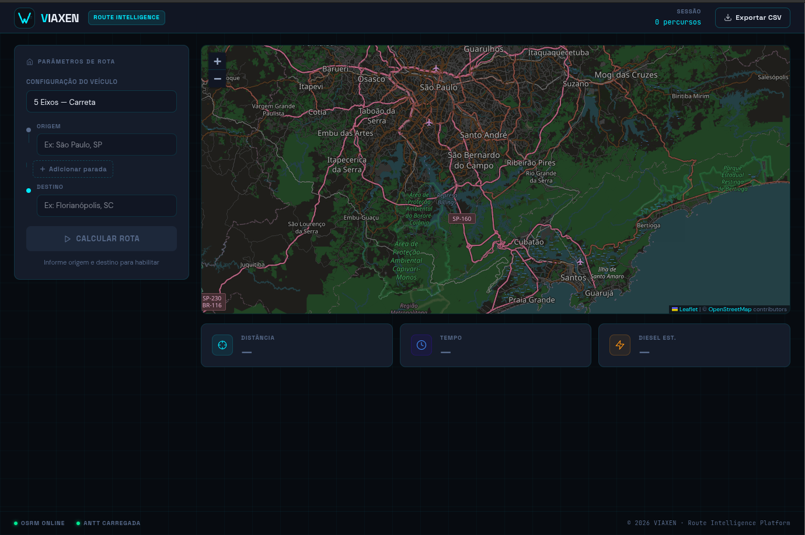

# VIAXEN — Route Intelligence Platform

> Plataforma de inteligência logística para cálculo de rotas e gestão de frete rodoviário.



---

## Sobre o Projeto

VIAXEN é um SaaS B2B de logística que permite calcular rotas rodoviárias, comparar alternativas de trajeto e estimar fretes com base na tabela oficial da ANTT (Resolução 5820/2019) — tudo em tempo real, sem custo de infraestrutura.

## Funcionalidades

- **Cálculo de rota** com visualização no mapa via OpenStreetMap + OSRM
- **3 rotas alternativas** — compare distância e tempo de cada opção
- **Paradas intermediárias** — adicione quantos waypoints precisar
- **Estimativa de frete** por tipo de carga (Geral, Granel, Frigorificado, Perigoso, Conteinerizado) com base nos eixos do veículo
- **KPIs em tempo real** — distância total, tempo de viagem e consumo estimado de diesel
- **Exportação CSV** para análise em Power BI ou Excel
- **PWA** — instalável no mobile e desktop, funciona offline após o primeiro acesso

## Stack

| Camada | Tecnologia |
|--------|-----------|
| Frontend | React 19 + TypeScript + Vite 5 |
| Estilo | Tailwind v4 + Design System próprio (tokens `--vx-*`) |
| Mapa | Leaflet + react-leaflet |
| Roteamento | OSRM (API pública) |
| Geocodificação | Nominatim / OpenStreetMap |
| Fretes | Parser CSV puro — Tabela ANTT 5820/2019 |
| PWA | vite-plugin-pwa + Workbox |
| Monorepo | pnpm workspaces |

## Como Rodar Localmente

```bash
# Instalar dependências
pnpm install

# Iniciar servidor de desenvolvimento
pnpm --filter web dev
```

Acesse `http://localhost:5173`

## Build de Produção

```bash
pnpm --filter web build
```

## Deploy

Hospedado na Vercel. O arquivo `vercel.json` na raiz já configura o build do monorepo pnpm automaticamente.

## Fonte dos Dados de Frete

Os valores de frete são calculados com base na **Resolução ANTT nº 5820/2019**, que define o piso mínimo do frete rodoviário por eixo e tipo de carga. Os dados estão em `apps/web/public/data/antt_frete.csv`.

---

Desenvolvido com React + OSRM + OpenStreetMap.
